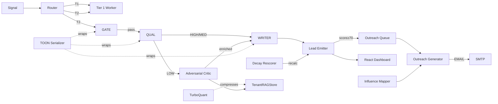

# ConvoSpan Intel — Agent Catalogue

> *Every autonomous process in the system, its role, inputs, outputs, and current status.*

---

## 🤖 Classification

The platform operates four classes of autonomous agents:
1. **Inference Agents** — LLM-powered prompt chains producing structured JSON
2. **Worker Agents** — BullMQ background processors (event-driven)
3. **Cron Agents** — Scheduled recurring processes
4. **Compiler Agents** — Data transformation utilities (no LLM)

---

## Class 1: Inference Agents

### 1.1 Gate Agent
| Property | Value |
|---|---|
| **File** | `src/core/gemini-chain.ts` — Tier 2 Worker |
| **Prompt Format** | `[TOON:GATE_v1]` |
| **Role System Prompt** | `"Role: B2B Gatekeeper [TOON_PARSER]. Respond JSON only."` |
| **Trigger** | Every signal routed to Tier 2 queue |
| **Input** | TOON-serialized `raw_payload`, geo market |
| **Output** | `{ is_buyer: bool, confidence: number, valid: bool, reason: string }` |
| **On Fail** | Signal discarded, `discarded:{source}:{date}` counter incremented in Upstash |
| **Provider** | ModelAPI → Gemini 1.5 Flash (role: `gate`) |
| **Status** | ✅ Active |

---

### 1.2 Qualifier Agent
| Property | Value |
|---|---|
| **File** | `src/core/gemini-chain.ts` — Tier 2 Worker |
| **Prompt Format** | `[TOON:QUALIFIER_v1]` |
| **Role System Prompt** | `"Role: Procurement Analyst [TOON_PARSER]. Respond JSON only."` |
| **Trigger** | Gate Agent returns `is_buyer=true` |
| **Input** | TOON payload, KnowledgeGraph context, company metadata |
| **Output** | `{ procurement_category, procurement_timeline, buying_stage, pain_point, confidence }` |
| **On LOW confidence** | Signal downgraded to Tier 3 enrichment pool |
| **Provider** | ModelAPI → Gemini 1.5 Pro (role: `qualifier`) |
| **Status** | ✅ Active |

---

### 1.3 Lead Writer Agent
| Property | Value |
|---|---|
| **File** | `src/core/gemini-chain.ts` — Tier 2 Worker |
| **Prompt Format** | `[TOON:LEAD_GEN_v1]` |
| **Role System Prompt** | `"Role: B2B Synthesizer [TOON_PARSER]. Respond JSON only."` |
| **Trigger** | Qualifier returns HIGH or MEDIUM confidence |
| **Input** | Qualifier output, company name, market, pain point |
| **Output** | `{ company, why_now, what_they_need, do_this }` — Lead Card |
| **Provider** | ModelAPI → Gemini 1.5 Pro (role: `writer`) |
| **Status** | ✅ Active |

---

### 1.4 Meta Synthesizer Agent
| Property | Value |
|---|---|
| **File** | `src/core/gemini-chain.ts` — Tier 2 Worker |
| **Prompt Format** | `[TOON:META_SYNTHESIS_v1]` |
| **Role System Prompt** | `"Role: Triangulation Synthesizer [TOON_PARSER]. Respond JSON only."` |
| **Trigger** | `is_triangulated=true` — multiple overlapping sources detected for same org |
| **Input** | TOON payload, overlapping sources list, previous signal context from Upstash |
| **Output** | Unified multi-source Lead Card with narrative citing multiple evidence points |
| **Provider** | ModelAPI → Gemini 1.5 Pro (role: `writer`) |
| **Status** | ✅ Active |

---

### 1.5 Advocate Agent (Adversarial Critic — Phase 1)
| Property | Value |
|---|---|
| **File** | `src/engines/AdversarialCritic.ts` |
| **Prompt Format** | TOON via `jsonToToon()` on `relevantDocs` |
| **Role** | Proposes the most optimistic interpretation of the signal and friction analysis |
| **Trigger** | Tier 3 enrichment jobs, or manually invoked via `b2bScraper.ts` |
| **Input** | Signal documents from Tenant RAG Store |
| **Output** | `{ leads: [...], frictionSignals: [...], overallAssessment }` |
| **Provider** | ModelAPI (role: inferred from `advocateTemplate`) |
| **Status** | ✅ Active |

---

### 1.6 Critic Agent (Adversarial Critic — Phase 2)
| Property | Value |
|---|---|
| **File** | `src/engines/AdversarialCritic.ts` |
| **Prompt Format** | TOON context + Advocate Proposal injected |
| **Role** | Audits the Advocate's proposal, challenges weak reasoning, confirms or refutes |
| **Trigger** | Always runs after Advocate Agent in same job |
| **Input** | TOON signal context + Advocate output JSON |
| **Output** | `{ is_valid: bool, confidence, refinedLeads, critiques }` |
| **Provider** | ModelAPI (role: `gate` or `qualifier`) |
| **Status** | ✅ Active |

---

### 1.7 Outreach Generator Agent
| Property | Value |
|---|---|
| **File** | `src/core/outreach/OutreachGenerator.ts` |
| **Prompt Format** | `[TOON:OUTREACH_GEN_v1]` + `[TOON:OUTREACH_CRITIC_v1]` |
| **Role** | Generates channel-specific outreach messages (EMAIL, WABA, LINKEDIN) |
| **Trigger** | Lead card approved for outreach (score ≥ 70 or manual approval) |
| **Input** | Lead data, tone preference, InfluenceMap warm entry points |
| **Output** | `{ subject, body, cta }` per channel |
| **Provider** | ModelAPI (role: `writer`) + Upstash spend guard cache |
| **Dispatch** | EMAIL → Nodemailer SMTP; WABA/LinkedIn → SDK stub (pending) |
| **Status** | ✅ Active (EMAIL); ⚠️ Stub (WABA, LinkedIn) |

---

## Class 2: Worker Agents (Event-Driven BullMQ)

### 2.1 Tier 1 Worker
| Property | Value |
|---|---|
| **File** | `src/core/gemini-chain.ts` |
| **Queue** | `tier1Queue` |
| **Trigger** | Signals with `source_tier = TIER_1` and `signal_strength ≥ 0.90` |
| **Behavior** | Rules-based lead card generation — **no LLM call**. Applies intent decay formula, emits via Socket.IO |
| **Concurrency** | 5 |
| **Status** | ✅ Active |

### 2.2 Tier 2 Worker
| Property | Value |
|---|---|
| **File** | `src/core/gemini-chain.ts` |
| **Queue** | `tier2Queue` |
| **Trigger** | Signals with `source_tier = TIER_2` — runs full Gate → Qualify → Write chain |
| **Spend Guard** | Checks `gemini_calls:{date}` in Upstash. Pauses if > 400/day |
| **Concurrency** | 2 |
| **Status** | ✅ Active |

### 2.3 Tier 3 Worker (Enrichment Pool)
| Property | Value |
|---|---|
| **File** | `src/core/gemini-chain.ts` / `src/engines` |
| **Queue** | `tier3Queue` |
| **Trigger** | LOW confidence signals from Qualifier, or direct routing |
| **Behavior** | Routes to Adversarial Critic loop for deeper enrichment before re-qualifying |
| **Status** | ✅ Active |

### 2.4 Scrape Worker
| Property | Value |
|---|---|
| **File** | `src/workers/scrapeWorker.ts` |
| **Queue** | `scrapeQueue` |
| **Trigger** | Manual scrape requests or scheduled scrape jobs |
| **Behavior** | Orchestrates Playwright-based `b2bScraper.ts` engine; also receives `ingest_registry_signal` jobs from IndiaMART collector |
| **Status** | ✅ Active |

### 2.5 Outreach Worker
| Property | Value |
|---|---|
| **File** | `src/workers/outreach_worker.ts` |
| **Queue** | `outreachQueue` |
| **Trigger** | Lead card pushed for approval |
| **Behavior** | Calls `OutreachGenerator.generate()`, saves payload, dispatches via channel |
| **Status** | ✅ Active |

---

## Class 3: Cron Agents (Scheduled)

### 3.1 Decay Rescorer
| Property | Value |
|---|---|
| **File** | `src/workers/decayRescoreWorker.ts` |
| **Schedule** | Configurable via `src/lib/scheduler.ts` (persisted to Postgres) |
| **Behavior** | Recalculates `decay_score` for all active leads using `I(t) = I₀ × e^(-λt)`. Tags signals as HOT / WARM / COLD. Emits re-score events to dashboard via Socket.IO |
| **Status** | ✅ Active |

### 3.2 Influence Map Builder
| Property | Value |
|---|---|
| **File** | `src/workers/influenceMapWorker.ts` |
| **Schedule** | Configurable via scheduler |
| **Behavior** | Builds warm entry point graphs between leads for the same org. Enriches outreach context with influence signals (mutual connections, shared sector events) |
| **Status** | ✅ Active |

### 3.3 Recalibration Engine
| Property | Value |
|---|---|
| **File** | `src/lib/recalibration.ts` |
| **Schedule** | Cron on server boot + interval |
| **Behavior** | Re-evaluates model calibration thresholds and signal routing weights based on feedback loop data |
| **Status** | ✅ Active |

---

## Class 4: Compiler Agents (Data Transformation)

### 4.1 TOON Serializer
| Property | Value |
|---|---|
| **File** | `src/lib/ai/toon.ts` |
| **Functions** | `jsonToToon(data)` and `toonToJson(toon)` |
| **Purpose** | Converts raw JSON payloads to compact TOON notation for ~30% token reduction in all LLM prompts |
| **Status** | ✅ Active — used in Gemini Chain, OutreachGenerator, AdversarialCritic, InfluenceInjector |

### 4.2 TurboQuant Compressor
| Property | Value |
|---|---|
| **File** | `src/core/rag/TenantRAGStore.ts` — `TurboQuant` class |
| **Purpose** | Scalar 8-bit quantization of 768-dim Gemini embedding vectors before storing in `MemoryVectorStore` |
| **Compression** | Up to 8x RAM reduction per vector |
| **Toggle** | `ENABLE_TURBOQUANT=false` env var reverts to full float storage |
| **Status** | ✅ Active (default on) |

### 4.3 Entity Resolver
| Property | Value |
|---|---|
| **File** | `src/core/entity-resolver.ts` |
| **Purpose** | Resolves any incoming company name to a canonical `organization_id` in Postgres using Double Metaphone phonetics + advisory lock for dedup safety |
| **Status** | ✅ Active |

### 4.4 Signal Formatter
| Property | Value |
|---|---|
| **File** | `src/core/signal-formatter.ts` |
| **Purpose** | Source-aware raw payload formatter. Converts IndiaMART / GeM / MCA / UAE raw formats into a normalized string for LLM context injection |
| **Status** | ✅ Active (being superseded by direct `jsonToToon()` in gemini-chain) |

### 4.5 Anonymization Pipeline
| Property | Value |
|---|---|
| **File** | `src/core/rag/AnonymizationPipeline.ts` |
| **Purpose** | Strips PII from signals before they enter the Tenant RAG Store, enforcing DPDP/GDPR compliance boundaries |
| **Status** | ✅ Active |

---

## 🗺️ Agent Communication Map

---

## ⚠️ Known Gaps & Pending Agent Work

| Gap | Priority | Notes |
|---|---|---|
| WABA dispatch SDK integration | High | `OutreachGenerator` has channel routing but no WABA SDK wired |
| LinkedIn outreach channel | Medium | Requires LinkedIn API token + OAuth per org |
| Webhook HMAC Verification Agent | High | `/api/ingest/*` is unprotected — needs `verifySignature` middleware |
| IP/CIDR Whitelist Enforcer | High | Middleware needed on ingestion routes |
| Tenant API Key Agent | High | `x-api-key` → Postgres `api_key_hash` lookup not yet implemented |
| Canary Signal Monitor | Low | `src/lib/canary.ts` exists but not wired to alerts pipeline |
| Dead Letter Queue processor | Medium | `src/lib/DeadLetterQueue.ts` logs failures; no retry orchestration UI |
