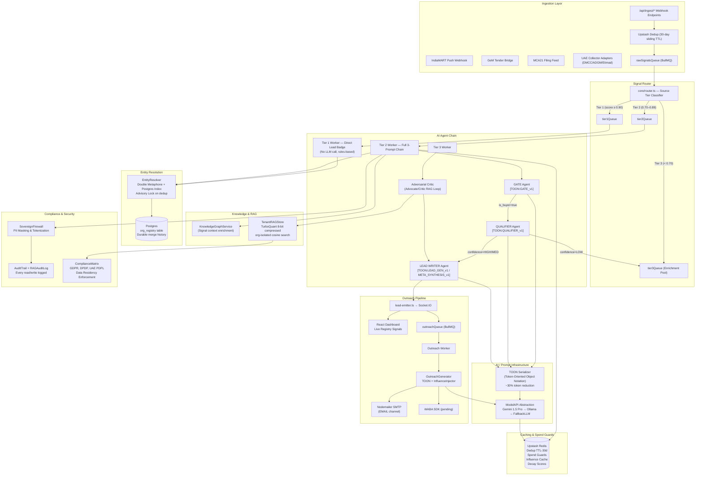

# ConvoSpan Intel: Architecture Reference

> *Government Registry Intelligence Layer — Sovereign Alpha Edition*

---

## 🌌 Mission

ConvoSpan Intel triangulates public government registry data across the **India/UAE corridor** to produce high-verity, time-bounded B2B buying intent intelligence. It shifts the paradigm from fragile web scraping to **legally defensible registry indexing** — sourcing data from MCA21, GeM, RERA, DMCC, ADGM, Etimad, and nine other authoritative public sources.

---

## 🏗️ System Topology



---

## 🤖 AI Agent Roles

| Agent | File | Trigger | Output |
|---|---|---|---|
| **Gate** | `gemini-chain.ts` | Every Tier 2 signal | `{ is_buyer, confidence, valid }` |
| **Qualifier** | `gemini-chain.ts` | Gate passes | `{ procurement_category, buying_stage, pain_point }` |
| **Lead Writer** | `gemini-chain.ts` | Qualifier passes | `Lead Card JSON` |
| **Meta Synthesizer** | `gemini-chain.ts` | `is_triangulated=true` | Unified multi-source lead card |
| **Advocate** | `AdversarialCritic.ts` | Tier 3 enrichment | Proposes best interpretation of signal |
| **Critic** | `AdversarialCritic.ts` | After Advocate | Audits and refutes/confirms proposal |
| **Outreach Generator** | `OutreachGenerator.ts` | Lead approved | Channel-specific outreach message |
| **Decay Rescorer** | `decayRescoreWorker.ts` | Cron (scheduled) | Re-scores all leads with `I(t)=I₀·e^(-λt)` |
| **Influence Mapper** | `influenceMapWorker.ts` | Cron (scheduled) | Graphs warm entry points between signals |

---

## 🗜️ TOON Prompt Optimization

**TOON (Token-Oriented Object Notation)** is a custom prompt micro-language that replaces verbose natural language instructions with structured, machine-readable semantics:

```
[TOON:QUALIFIER_v1]
COMP: Emaar Properties | LOC: Dubai (AE)
SRC: dmcc
DATA:
company_name: Emaar Properties
activity: Real Estate Development
---
TASKS:
1. procurement_category -> focus area
OUT: { "procurement_category": "str", ... }
[/TOON]
```

Benefits: eliminates ~30% of outbound tokens, reduces TTFT (Time To First Token), enforces deterministic output structure for JSON parsing.

---

## 🗜️ TurboQuant Vector Compression

Inspired by the Google Research TurboQuant paper (ICLR 2026), the `TenantRAGStore` compresses Gemini embedding vectors before storing in memory:

- Full 64-bit float `number[]` (768 dims) → `Uint8Array` (8-bit scalar quantization)
- Up to **8x RAM reduction** per stored vector
- Seamless decompression on `similaritySearch()` with 0 accuracy impact
- Toggle via `ENABLE_TURBOQUANT=false` env var

---

## 💾 Data Storage Schema

| Store | Technology | Purpose |
|---|---|---|
| `org_registry` | Postgres | Canonical organization entity index with merge history |
| `scrape_results` | Postgres | Enriched lead cards with decay scores, feedback, audit |
| `campaigns` | Postgres | Campaign metadata and ROI tracking |
| `outreach_log` | Postgres | Dispatch records with 7-day cooldown enforcement |
| `rag_audit_log` | Postgres | All vector store read/write operations |
| `audit_log` | Postgres | All AI decision events |
| Dedup cache | Upstash Redis | 30-day sliding window deduplication by `query_id` or content hash |
| Spend guard | Upstash Redis | Daily Gemini API call limit (default: 400/day) |
| Context history | Upstash Redis | Per-org signal triangulation context for multi-source synthesis |

---

## 🔌 API Surface

| Route Group | File | Auth | Description |
|---|---|---|---|
| `POST /api/ingest/*` | `routes/ingest.ts` | ⚠️ None | Webhook endpoints for all data sources |
| `GET /api/results` | `routes/results.ts` | Tenant | Paginated lead card feed |
| `GET/POST /api/leads` | `routes/leads.ts` | Tenant | Lead management and Re-Engage Queue |
| `POST /api/outreach` | `routes/outreach.ts` | Tenant | Approve outreach and trigger dispatch |
| `GET /api/campaigns` | `routes/campaigns.ts` | Tenant | Campaign CRUD |
| `GET /api/share/:token` | `routes/share.ts` | Public | HMAC-verified public share links |
| `GET /api/admin/*` | `routes/admin.ts` | Admin | Registry stats, system health |
| `GET /api/vault` | `routes/vault.ts` | Tenant | PII vault access (Covospan only) |
| `POST /api/capsules` | `routes/capsules.ts` | Tenant | Data capsule packaging |
| `GET /metrics` | `server.ts` | Internal | Prometheus metrics endpoint |
| `GET /health` | `server.ts` | Public | System health check |

---

## 🔐 Security Status

| Control | Implementation | Status |
|---|---|---|
| Multi-tenant SQL isolation | Postgres RLS partitioning | ✅ Active |
| PII masking | `SovereignFirewall` + `AnonymizationPipeline` | ✅ Active |
| HMAC data integrity | SHA-256 signed capsules & ROI PDFs | ✅ Active |
| Audit logging | `AuditTrail.ts` + `RAGAuditLog.ts` | ✅ Active |
| Compliance matrix | GDPR, DPDP (India), UAE PDPL | ✅ Active |
| RAG cross-contamination guard | Namespace validation in `TenantRAGStore` | ✅ Active |
| **Webhook HMAC signature verification** | `x-source-signature` middleware | ⚠️ Pending |
| **IP/CIDR whitelisting on ingestion** | Express middleware on `/api/ingest` | ⚠️ Pending |
| **Tenant API key authentication** | `x-api-key` → `api_key_hash` in Postgres | ⚠️ Pending |
| Proxy mesh for scrapers | `ProxyManager.ts` → Bright Data / Oxylabs | ⚠️ Creds Required |

---

## 🧭 Dual-Mode Deployment

| Aspect | Standalone (SaaS) | Covospan (Institutional) |
|---|---|---|
| Entry | `src/modes/standalone/index.ts` | `src/modes/covospan/index.ts` |
| Auth | Header-based tenant derivation | Full Covospan auth context |
| Feature access | Freemium gated via `featureGate.ts` | All features unlocked |
| Vault access | Disabled | Enabled |
| MCP tools | Disabled | Enabled |
| Routes | Standalone + Share + Admin | Full route set + Covospan extensions |
